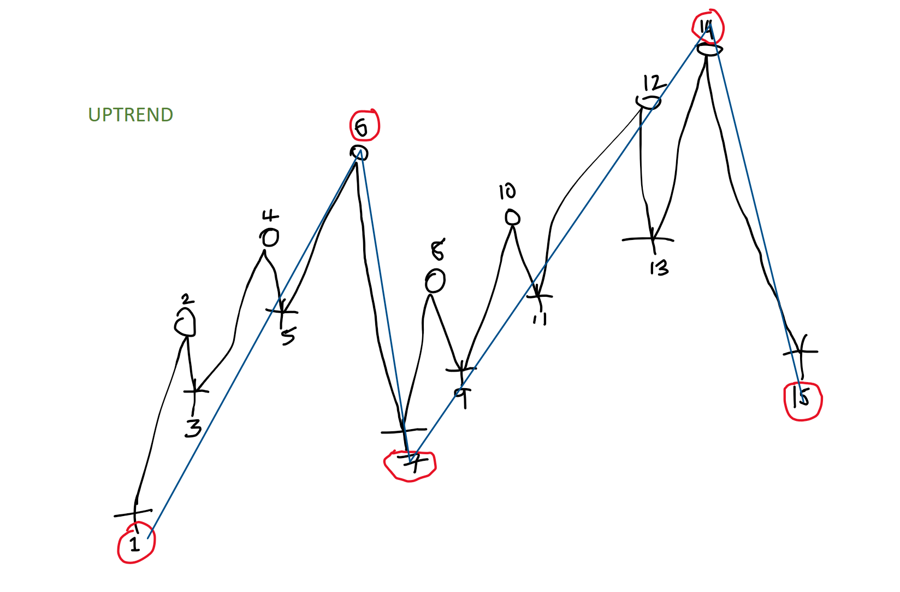
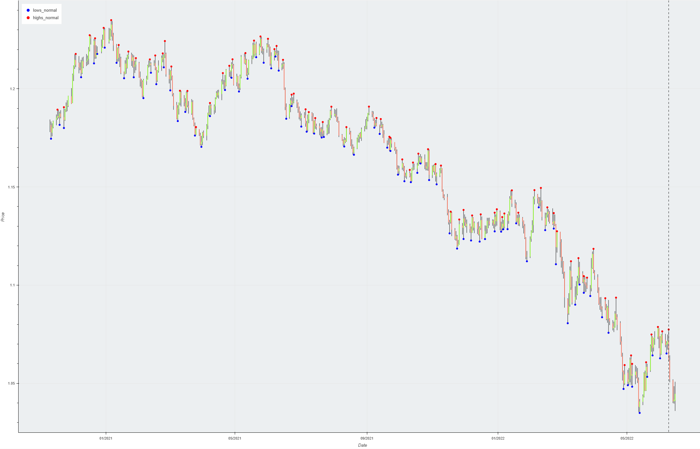
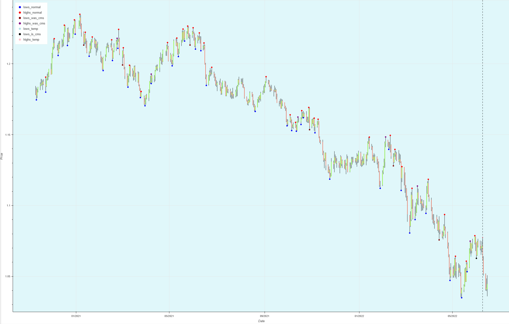

# Peak-Finder: A Simple(ish) Algorithm for Detecting Market Peaks and Troughs
## What's the Goal?
I created this algorithm to fix a problem I kept running into with standard peak and trough finders. When analyzing market data, I wanted to use peaks and troughs to figure out trends—whether the market was bullish (going up) or bearish (going down).

But the usual algorithms gave way too many peaks and troughs, which made it hard to see the big picture. So, I needed something that could narrow things down and focus on the important points.

## How It Works

The idea is simple: the algorithm finds peaks and troughs, but it has some rules to keep things clean and useful.

1) Alternating Sequence: It follows a strict sequence: Peak -> Trough -> Peak -> Trough... and so on. No jumping around, it has to be in that order.

2) Trend Detection:
   - Two increasing peaks and troughs = bullish (market's going up).
   - Two decreasing peaks and troughs = bearish (market's going down).

3) Cleanup Invalid Peaks/Troughs:

    - When a new trough shows up, the algorithm checks if it's lower than the previous trough. If it is, it removes some older points that no longer fit the trend and makes sure the sequence stays valid.
    - Same goes for peaks.

## Example to Make it Clear: 
Take a look at this example:

Before the algorithm gets to point 7, all the previous points (nodes) are fine. But as soon as point 7 comes in, points 2-5 are no longer valid, so barring a trend change, they will get removed to keep everything tidy. 
However, the algorithm won't remove those points until it sees enough evidence to determine the trend isn't changing. 
For instance, it would wait until node 12 in the example before cleaning up the earlier points.

## What It Looks Like:
Here’s how a normal peak and trough finder would handle this market data:

And here’s how my algorithm cleans it up, finding the important peaks and troughs:

It basically filters out all the unnecessary noise, leaving you with a much clearer picture of the market swings.

## Core Data Structures
- Doubly Linked List: I’m using a Doubly linked list to store all the peaks and troughs. This makes it easy to add new points and remove the ones that are no longer needed. It was make searching for nearby peaks or troughs easier.
- Node Class: Each point (whether it's a peak or trough) is represented by a Node. The Node has some basic properties:
  - Value: The actual data (price, for example).
  - Numerous Flags: To keep track of the node's status.
  - Adjacent Nodes: The previous and next nodes in the list.

## Observer Pattern
To keep things organized, I’m using an Observer Pattern. 
This setup allows the list to get notified whenever a node changes. Why? So we can take snapshots of the list at different points in time. 
These snapshots can be replayed later, making it easier to see how the algorithm worked over time.

Check out `main.py` for an example of how this works in practice!